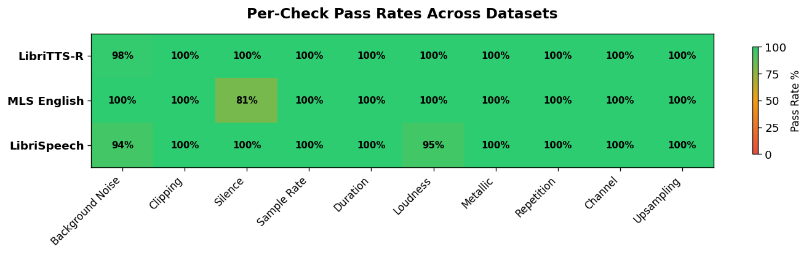

# Audio Data Quality Toolkit

Upload audio files and get instant quality reports. 13 automated checks, zero GPU.

**Install locally:** `pip install audio-data-quality-toolkit`

**GitHub:** [audio-data-quality-tool](https://github.com/EmmanuelleB985/audio-data-quality-tool) | **PyPI:** [audio-data-quality-toolkit](https://pypi.org/project/audio-data-quality-toolkit/) | **Colab:** [Notebook](https://drive.google.com/file/d/1xP6a21lmb1cF2suNOcW_ege9Ne9bn_CB/view?usp=sharing)

---

## What it does

The toolkit runs 13 signal-level checks per file: SNR estimation, clipping detection, silence analysis, sample rate validation, duration bounds, loudness (LUFS), metallic artifact detection, repetition detection, channel issues, upsampling detection, transcript-audio ratio, duplicate fingerprinting, and a composite quality score (0-10).

Everything runs on CPU with numpy, scipy, and librosa.

## Quick start

```python
from datasets import load_dataset
from audio_qa import audit_hf_dataset

ds = load_dataset("blabble-io/libritts_r", "clean",
                  split="train.clean.100", streaming=True)
report = audit_hf_dataset(ds, max_samples=500)
print(report.summary())

# Actionable outputs
report.export_clean_manifest("clean.txt")   # file list for training
report.to_csv("qa_report.csv")              # per-file breakdown
clean_ds = report.filter_hf_dataset(ds)     # filtered HF dataset
```

## Benchmark: 1,500 files across 3 TTS datasets in under 3 minutes

We audited 500 samples each from LibriTTS-R, MLS English, and LibriSpeech on a free Google Colab CPU:

| Dataset | Clean % | Avg Score | Main Failures | Audit Time |
|---------|---------|-----------|---------------|------------|
| **LibriTTS-R** | 98% | 8.9/10 | Background noise (2%) | 44s |
| **MLS English** | 81% | 9.6/10 | Silence (19%) | 98s |
| **LibriSpeech** | 89% | 9.4/10 | Noise (6%), Loudness (5%) | 33s |

**Total: 2.9 minutes for 1,500 files. No GPU.**

### Per-check pass rates



| Check | LibriTTS-R | MLS English | LibriSpeech |
|-------|-----------|-------------|-------------|
| Background noise | 98% | 100% | 94% |
| Clipping | 100% | 100% | 100% |
| Silence | 100% | 81% | 100% |
| Sample rate | 100% | 100% | 100% |
| Duration | 100% | 100% | 100% |
| Loudness | 100% | 100% | 95% |
| Metallic artifacts | 100% | 100% | 100% |
| Repetition | 100% | 100% | 100% |
| Channel | 100% | 100% | 100% |
| Upsampling | 100% | 100% | 100% |
| Transcript ratio | -- | 100% | 100% |

### Duration vs quality score


## Key findings

- **Quality score ≠ pass rate.** MLS scores highest (9.6/10) but has the lowest pass rate (81%) due to untrimmed silence. Score captures signal quality; pass rate captures training readiness.
- **Silence is the dominant issue in MLS.** 19% of files have excessive leading/trailing silence or internal gaps wasted compute during training.
- **LibriSpeech "clean" has moderate noise and loudness variation.** The "clean" label reflects transcript accuracy more than signal quality.
- **LibriTTS-R benefits from speech restoration.** Only 2% fail any check, all on borderline background noise.
- **None of the datasets achieve a 100% overall pass rate.** Across 1,500 files, 162 failed at least one check. Filtering before training is worth the 3 minutes.

## Speed

| Files | Time (Colab free, CPU) | Time (local, 4 workers) |
|-------|----------------------|------------------------|
| 500 | ~30s-1.5 min | ~15-30s |
| 1,000 | ~1-3 min | ~30s-1 min |
| 10,000 | ~10-30 min | ~3-8 min |

## How this relates to existing tools

| Tool | Method | GPU | Output | Question |
|------|--------|-----|--------|----------|
| **NISQA** | CNN + self-attention on mel-specs | Yes | MOS 1-5 | Perceptual quality |
| **UTMOS** | Fine-tuned SSL ensemble | Yes | MOS 1-5 | Naturalness of synthetic speech |
| **PESQ** | Time-aligned perceptual comparison | No | Score -0.5 to 4.5 | Degradation vs reference |
| **DataSpeech** | SNR/pitch/rate + LLM descriptions | Yes | NL descriptions | Acoustic characteristics |
| **audio-qa** | Deterministic signal checks (FFT, RMS, LUFS) | No | Score 0-10 + pass/fail + manifest | Training readiness |

Use NISQA/UTMOS to assess output quality of your trained model. Use audio-qa to clean the training data going in.

---

MIT licensed. Contributions welcome.
